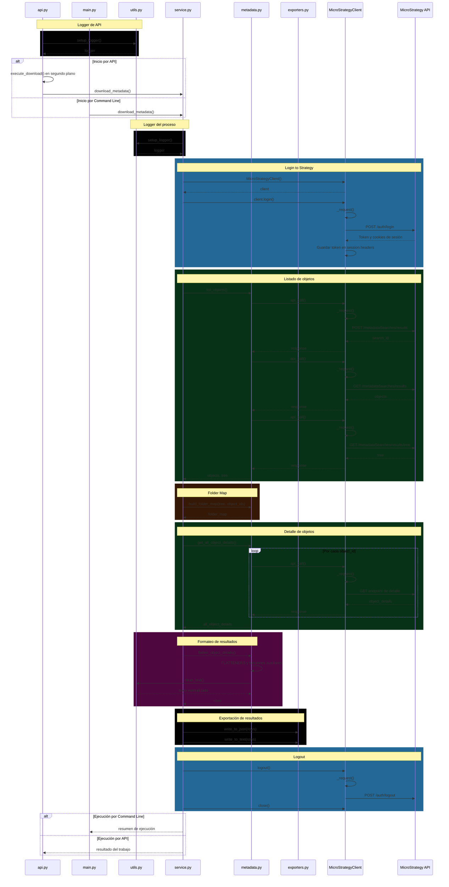

```mermaid
sequenceDiagram
    participant A as api.py
    participant M as main.py
    participant U as utils.py
    participant S as service.py
    participant MD as metadata.py
    participant E as exporters.py
    participant C as MicroStrategyClient
    participant API as MicroStrategy API

    %% Logger de API
    Note over A,U: Logger de API
    rect rgb(1, 1, 1)
        A->>U: setup_logger()
        U-->>A: logger
    end

    %% Inicio alternativo por API o línea de comandos
    alt Inicio por API
        A->>A: execute_download() en segundo plano
        A->>S: download_metadata()
    else Inicio por Command Line
        M->>S: download_metadata()
    end

    %% Logger del proceso
    Note over S,U: Logger del proceso
    rect rgb(1, 1, 1)
        S->>U: setup_logger()
        U-->>S: logger
    end

    %% Login
    rect rgb(35, 104, 150)
        Note over S,API: Login to Strategy
        S->>C: MicroStrategyClient()
        C-->>S: client
        S->>C: client.login()
        C->>C: _request()
        C->>API: POST /auth/login
        API-->>C: Token y cookies de sesión
        C->>C: Guardar token en session.headers
    end

    %% Listado de objetos
    rect rgb(8, 50, 23)
        Note over S,API: Listado de objetos
        S->>MD: list_objects()
        MD->>C: api_call()
        C->>C: _request()
        C->>API: POST /metadataSearches/results
        API-->>C: search_id
        C-->>MD: response

        MD->>C: api_call()
        C->>C: _request()
        C->>API: GET /metadataSearches/results
        API-->>C: objects
        C-->>MD: response

        MD->>C: api_call()
        C->>C: _request()
        C->>API: GET /metadataSearches/results/tree
        API-->>C: tree
        C-->>MD: response

        MD-->>S: objects, tree
    end

    %% Construcción del mapa de carpetas
    rect rgb(53, 24, 5)
        Note over S,MD: Folder Map
        S->>MD: build_folder_map(tree, object_ids)
        MD-->>S: folder_map
    end

    %% Detalle de objetos
    rect rgb(8, 50, 23)
        Note over S,API: Detalle de objetos
        S->>MD: get_all_object_details()

        loop Por cada object_id
            MD->>C: api_call()
            C->>C: _request()
            C->>API: GET endpoint de detalle
            API-->>C: object_details
            C-->>MD: response
        end

        MD-->>S: all_object_details
    end

    %% Transformación a registros planos
    rect rgb(79, 7, 63)
        Note over S,MD: Formateo de resultados
        S->>MD: flatten_object_details()
        MD->>MD: FLATTENERS y funciones auxiliares
        MD->>U: clean_text()
        U-->>MD: texto normalizado
        MD-->>S: rows
    end

    %% Exportación
    rect rgb(1, 1, 1)
        Note over S,E: Exportación de resultados
        S->>E: write_to_json(rows)
        S->>E: write_to_text(rows)
    end

    %% Logout
    rect rgb(35, 104, 150)
        Note over S,API: Logout
        S->>C: logout()
        C->>C: _request()
        C->>API: POST /auth/logout
        S->>C: close()
    end

    alt Ejecución por Command Line
        S-->>M: resumen de ejecución
    else Ejecución por API
        S-->>A: resultado del trabajo
    end
```